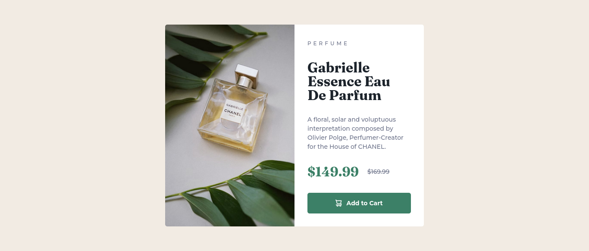

# Frontend Mentor - Product preview card component solution

This is a solution to the [Product preview card component challenge on Frontend Mentor](https://www.frontendmentor.io/challenges/product-preview-card-component-GO7UmttRfa). Frontend Mentor challenges help you improve your coding skills by building realistic projects. 

## Table of contents

- [Overview](#overview)
  - [The challenge](#the-challenge)
  - [Screenshot](#screenshot)
  - [Links](#links)
- [My process](#my-process)
  - [Built with](#built-with)
  - [What I learned](#what-i-learned)
  - [Useful resources](#useful-resources)
- [Author](#author)

## Overview

### The challenge

Users should be able to:

- View the optimal layout depending on their device's screen size
- See hover states for interactive elements

### Screenshot



### Links

- Solution URL: https://www.frontendmentor.io/solutions/product-preview-card-component-S39Fw_wRgJ
- Live Site URL: https://alaa-mekibes.github.io/product-preview-card-component-frontend-mentor

## My process

### Built with

- Semantic HTML5 markup
- CSS custom properties
- Flexbox

### What I learned

I learned how to add an image for desktop and how to change it for mobile using the `<picture>` tag.

```html
<picture>
<!-- Here Add all the images with small screen -->
         <source
                    media="(max-width: 375px)"
                    srcset="images/image-product-mobile.jpg"
                    >
<!-- Here Add the default image -->
         
</picture>
```

### Useful resources

- [How to display different images in mobile and desktop devices](https://stackoverflow.com/questions/39891785/how-to-display-different-images-in-mobile-and-desktop-devices) - This helped me for adding `<picture>` tag. I really liked this pattern and will use it going forward.

## Author

- Frontend Mentor - [@alaa-mekibes](https://www.frontendmentor.io/profile/alaa-mekibes)
